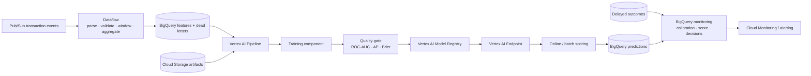

# GCP ML Platform

A Google Cloud reference architecture for **streaming data ingestion, model training, registry, managed scoring and delayed-label monitoring**. The main public example is a synthetic banking-risk workload so the cloud services map to a realistic ML lifecycle instead of disconnected hello-world deployments.

> Portfolio reference implementation only. All banking data and examples are synthetic.

## Banking architecture



## What is implemented

### Pub/Sub → Dataflow streaming features

`examples/pubsub_dataflow_risk_features.py` is a concrete Apache Beam streaming pipeline rather than a service-name placeholder. It:

1. reads transaction events from a Pub/Sub subscription;
2. parses and validates JSON payloads;
3. sends malformed events to an explicit dead-letter output;
4. assigns business event timestamps;
5. computes five-minute sliding-window customer features every minute;
6. writes aggregate risk features to BigQuery;
7. writes invalid payloads and processing errors to a separate BigQuery table.

The window produces features such as transaction count, amount sum/max, cross-border count and merchant diversity. This gives the repository a real event-time feature path that can be discussed independently of the offline training pipeline.

### Infrastructure as Code

Terraform examples provision core GCP ML infrastructure such as:

- Cloud Storage;
- Artifact Registry;
- Cloud Run;
- Pub/Sub;
- BigQuery;
- service configuration suitable for a containerized ML workload.

### BigQuery → Vertex AI scoring

`examples/banking_batch_scoring.py` demonstrates:

1. reading ordered banking feature rows from BigQuery;
2. converting them to Vertex AI endpoint instances;
3. calling a managed endpoint;
4. mapping probabilities to `auto_approve`, `human_review` and `auto_decline` routes;
5. writing scored applications back to BigQuery.

This makes the repo useful for discussing the boundary between **warehouse analytics and production model serving**.

### Vertex AI Pipeline

`pipelines/banking_vertex_pipeline.py` defines a KFP/Vertex-oriented lifecycle:

```text
BigQuery extract
      ↓
training component
      ↓
offline metrics
      ↓
quality gate
      ↓
Vertex Model Registry
      ↓
managed endpoint deployment
```

The pipeline includes explicit quality gates for ROC-AUC, average precision and Brier score. Model registration is downstream of that gate rather than happening automatically after every training run.

The file can compile a pipeline specification and optionally submit a `PipelineJob`.

### Delayed-label monitoring

The repository contains two complementary warehouse-side monitoring examples.

`examples/banking_model_monitoring.py` produces operational summaries for scored/labeled applications:

- daily scored volume;
- mean / standard deviation of risk score;
- approval / decline / human-review rates;
- labeled event rate;
- Brier score when outcomes arrive;
- calibration bins with predicted vs observed event rates.

`monitoring/delayed_label_monitoring.sql` keeps the same logic directly in BigQuery SQL for an operations-oriented path where labels arrive after the decision. The separation is intentional: prediction-time observability and outcome-time model evaluation are not the same signal.

The goal is not to claim that SQL replaces a complete monitoring platform. It demonstrates how delayed banking outcomes can be joined back to model decisions for operational evaluation.

### Credential-free CI

`.github/workflows/ci.yml` validates the public repository without requiring a live GCP project or service-account key. Every push and pull request runs:

- Ruff over Python examples and pipeline definitions;
- Python bytecode compilation for the examples and Vertex pipeline;
- a repository check that the delayed-label monitoring SQL is present.

Live deployment remains deliberately separate from repository quality checks. CI can therefore verify source quality without granting cloud credentials to pull-request code.

## Core GCP service map

| Concern | Google Cloud service | Portfolio use |
|---|---|---|
| Object storage | Cloud Storage | datasets and model artifacts |
| Analytical warehouse | BigQuery | feature tables, predictions, delayed labels, monitoring |
| Event messaging | Pub/Sub | transaction / application events |
| Stream / batch processing | Dataflow | transformation and event-time feature pipelines |
| Managed ML | Vertex AI | pipelines, model registry, endpoints |
| Container serving | Cloud Run | stateless APIs and lightweight inference services |
| Kubernetes | GKE | workloads requiring Kubernetes-level control |
| OLTP database | Cloud SQL / AlloyDB | application metadata / relational state |
| Cache | Memorystore | Redis-style low-latency state |
| Images | Artifact Registry | container images |
| Secrets | Secret Manager | credentials / secret configuration |
| Observability | Cloud Monitoring + Logging | platform metrics, logs and alerts |

## BigQuery vs Cloud SQL

A common interview distinction:

- **BigQuery** is a serverless analytical warehouse for large scans and aggregations.
- **Cloud SQL** is managed relational OLTP for transactional application workloads.

This repository deliberately uses BigQuery for analytical/scoring history rather than pretending it is the application's transactional database.

## Cloud Run vs GKE

**Cloud Run** is a strong default for stateless HTTP containers when low operational overhead and autoscaling are priorities.

**GKE** becomes attractive when the system requires deeper Kubernetes control: custom scheduling, complex sidecars/operators, specialized networking, multi-service platform patterns or GPU scheduling requirements.

## GCP interview path represented here

A candidate should be able to explain:

- Pub/Sub vs BigQuery;
- Dataflow's role between event transport and analytical storage;
- processing time vs event time and why windowing uses business timestamps;
- dead-letter handling for invalid streaming events;
- BigQuery vs Cloud SQL;
- Vertex AI Pipeline vs Model Registry vs Endpoint;
- model artifact vs serving container;
- batch vs online scoring;
- IAM / service-account boundaries;
- Cloud Run vs GKE;
- Cloud Storage vs BigQuery;
- monitoring when ground-truth labels arrive with delay;
- why a production model needs deployment gates and lineage rather than only a `.pkl` file.

## Cross-cloud translation

The same logical ML workload is represented elsewhere in the portfolio so architecture can be translated rather than memorized vendor-by-vendor:

| Capability | GCP | AWS analogue | Azure analogue |
|---|---|---|---|
| Object storage | Cloud Storage | S3 | Blob / ADLS |
| Warehouse | BigQuery | Redshift / Athena | Synapse / Fabric |
| Events | Pub/Sub | SNS/SQS/Kinesis/MSK depending pattern | Service Bus / Event Hubs |
| Managed ML | Vertex AI | SageMaker | Azure ML |
| Container runtime | Cloud Run / GKE | ECS/EKS | Container Apps/AKS |
| Monitoring | Cloud Monitoring | CloudWatch | Azure Monitor |

The intent is **concept portability**: understand what the architecture needs, then map it to the appropriate managed service.
