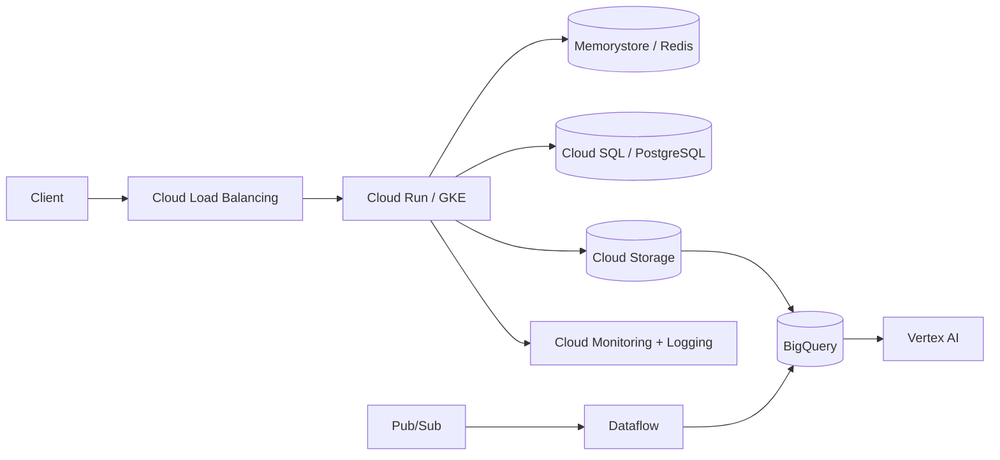

# GCP ML Platform

A vendor-specific reference architecture for serving and operating ML workloads on Google Cloud.

## Core services demonstrated

- VPC networking and private service connectivity
- Cloud Run / GKE for inference services
- Cloud Storage for artifacts and datasets
- Pub/Sub + Dataflow for event/stream processing
- BigQuery for analytics
- Vertex AI for training, registry and endpoints
- Cloud SQL / Memorystore for persistence and caching
- IAM, Secret Manager, Cloud Monitoring and Logging

The application logic mirrors the AWS/Azure/Huawei variants so infrastructure tradeoffs can be compared directly.
